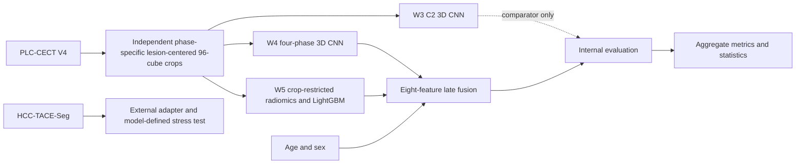

# Multimodal Classification of Primary Liver Tumors on Multiphase CT

Research software and privacy-safe aggregate results for **“Multimodal Classification of
Primary Liver Tumors on Multiphase CT: Internal Fusion Performance and External
Transportability Stress Testing.”**

This repository documents the analysis pipeline and provides tested aggregate reanalysis
utilities. It is intended for research and methodological review only. It is not a medical
device and must not be used for clinical diagnosis, treatment selection, or patient management.

## Research objective

The study compared clinical, deep-learning, radiomics, and late-fusion approaches for
three-class discrimination of hepatocellular carcinoma (HCC), intrahepatic
cholangiocarcinoma (ICC), and combined hepatocellular-cholangiocarcinoma (cHCC-CCA) on
multiphase contrast-enhanced CT. A separate HCC-only cohort was used to stress-test
transportability under substantial data and adapter shift.

## Cohorts and evaluation design

- Internal PLC-CECT V4 cohort: 278 patients—94 HCC, 99 ICC, and 85 cHCC-CCA.
- Development cohort: 222 patients with five patient-level stratified folds.
- Independent internal evaluation cohort: 56 patients.
- Internal sex provenance: 185 male, 90 female, and 3 unresolved entries.
- External HCC-TACE-Seg stress-test cohort: 103 retained known-HCC patients.
- All phases from one internal patient remained in the same partition.
- Patient identifiers, patient-level splits, predictions, images, masks, and clinical rows
  are intentionally not distributed.

The external experiment is an HCC-recognition stress test, not multiclass external
validation, and does not provide an external multiclass AUC.

## Pipeline



### Internal preprocessing

Each CT phase was independently liver-masked and cropped to a `96 × 96 × 96`-voxel
region centered on the tumor-mask centroid identified in that phase. The four independently
lesion-centered crops were then stacked as multiphase CNN channels. No explicit interphase
registration or physical-coordinate mapping was performed, so equivalent tensor locations
across channels were not guaranteed to depict identical anatomy. The internal pipeline did
not add resampling beyond the source release.

W5 features describe the tumor portion retained within each fixed crop. Cached arrays lacked
source geometry and spacing; conversion to SimpleITK images used default unit spacing.
Radiomics shape outputs are therefore crop-grid or voxel-coordinate descriptors, not verified
physical-millimeter measurements.

### Model branches

- **W3:** portal-venous C2-only, randomly initialized MONAI 3D ResNet-18 with input shape
  `1 × 96 × 96 × 96`.
- **W4:** four-phase, randomly initialized MONAI 3D ResNet-18 with input shape
  `4 × 96 × 96 × 96`. Training augmentation applied selected in-plane flips jointly across
  channels and per-channel intensity jitter. Validation and evaluation used no augmentation.
- **W5:** 107 original-image PyRadiomics features per phase, 428 candidate features in total,
  fold-specific selection, and LightGBM classification.
- **Clinical baseline:** age and sex.
- **Late fusion:** fold-specific multinomial logistic regression.

### Exact full-fusion input

The full-fusion model has exactly eight ordered inputs:

1. W4 HCC probability
2. W4 ICC probability
3. W4 cHCC-CCA probability
4. W5 HCC probability
5. W5 ICC probability
6. W5 cHCC-CCA probability
7. Age
8. Sex

W3 is a comparator and is excluded from full fusion. The order is enforced in
[`fusion.py`](src/liver_tumor_pipeline/fusion.py) and tested with synthetic arrays.

## Corrected primary internal performance

Unresolved internal sex entries were retained as missing. Each clinical or full-fusion
logistic-regression model imputed missing values using its training-fold median. W3, W4, W5,
the CNN-plus-radiomics branch, and all upstream CNN/radiomics outputs remained frozen.

| Model | Five-fold CV AUC, mean ± SD | Held-out AUC (95% CI) |
|---|---:|---:|
| Clinical baseline | 0.649 ± 0.073 | 0.614 (0.499–0.721) |
| W3 single-phase CNN | 0.912 ± 0.048 | 0.860 (0.784–0.928) |
| W4 multiphase CNN | 0.951 ± 0.040 | 0.906 (0.829–0.971) |
| W5 radiomics-LightGBM | 0.922 ± 0.044 | 0.938 (0.879–0.979) |
| CNN + radiomics fusion | 0.955 ± 0.034 | 0.930 (0.854–0.986) |
| Full fusion | 0.955 ± 0.033 | 0.945 (0.890–0.984) |

Corrected full fusion classified 45/56 patients correctly (accuracy 0.804), with macro-F1
0.805 and macro precision 0.819. Per-class AUCs were 0.939 for HCC, 0.964 for ICC, and
0.934 for cHCC-CCA.

The historical encoding mapped every non-male token to zero. It produced held-out AUCs
0.630 for the clinical baseline and 0.950 for full fusion. Corrected handling changed one
full-fusion held-out prediction and no full-fusion OOF hard prediction. Historical values are
retained only as a provenance sensitivity analysis in
[`internal_sex_sensitivity.csv`](results/aggregate/internal_sex_sensitivity.csv).

The tumor-size-only development-CV baseline was `0.633 ± 0.080`.

### Statistical analysis

Nine per-class DeLong comparisons were exploratory. The smallest raw two-sided p-value was
0.029347 for full fusion versus W4 in cHCC-CCA; its Bonferroni and Benjamini–Hochberg values
were both 0.264126. Full fusion versus W5 radiomics in cHCC-CCA had `p = 0.345737`.
No comparison remained significant after either nine-test adjustment.

Across five paired folds, paired t-test p-values for full fusion versus the clinical baseline,
W3, W4, W5, and CNN-plus-radiomics were 0.0018, 0.0946, 0.6698, 0.0625, and 0.9329.
Corresponding exact two-sided Wilcoxon p-values were 0.0625, 0.0625, 0.6250, 0.0625,
and 0.8125. These fold tests are exploratory.

## External HCC-only stress test

No retained external patient had all four required phases. The external adapter differed
from the internal workflow in source conversion, resampling, crop construction, phase
availability, segmentation inputs, feature availability, and missing-data handling.
Degradation cannot be assigned to a single source of shift.

| Branch or model-defined scenario | HCC sensitivity |
|---|---:|
| W3 frozen inference | 5/103 = 0.049 |
| W4 frozen inference | 0/103 = 0.000 |
| W5 baseline real-plus-imputed handling | 99/103 = 0.961 |
| Full fusion, missing sex with fold-local median | 83/103 = 0.806 |
| Full fusion, encoded sex=0 sensitivity | 2/103 = 0.019 |

External age and sex were unavailable. In the corrected primary model-defined scenario,
both were passed as missing and replaced by each internally fitted model’s training-fold
median; all five sex medians were 1. The encoded-sex-zero scenario was evaluated separately.
The scenarios produced class counts 83/7/13 and 2/68/33 for HCC/ICC/cHCC-CCA and differed
for 82/103 hard predictions. Neither scenario represents observed external sex.

For the primary and frozen-pathway analyses, no external values or labels were used for fitting,
selection, recalibration, or tuning. Corrected clinical and fusion logistic-regression models
were refitted only on internal OOF data; no W3, W4, W5, CNN, radiomics extractor, or LightGBM
model was retrained. Condition C is the separately disclosed label-free availability-subset
diagnostic described below.

C2 referenced-series fallback occurred in 102/103 patients. The corrected primary scenario
recognized 82/102 HCC cases in that group and 1/1 in the nonfallback group; the single
nonfallback patient prevents a meaningful comparison.

### Radiomics imputation controls

| Condition | HCC sensitivity | Status |
|---|---:|---|
| A: Real + imputed | 0.961 | Frozen baseline pathway |
| B: Median-only | 1.000 | Frozen sensitivity pathway |
| C: Strict overlap-only | 0.243 | Internal diagnostic refit |
| D1: Real-only, unavailable cells zeroed | 0.010 | Frozen sensitivity pathway |
| D2: Imputed-only, real cells zeroed | 0.971 | Frozen sensitivity pathway |

Condition C refitted radiomics classifiers on the internal development cohort using an
externally defined feature-availability subset. It was an internal diagnostic refit, not
frozen-model external validation. The controls show that apparent external radiomics
sensitivity depended strongly on the imputation pathway.

## Fixed-crop retention limitation

The retained artifacts support a C2-only aggregate audit; original geometry and crop
coordinates required for an equivalent four-phase audit were not preserved.

| C2 result | Patients |
|---|---:|
| Exact retention | 124/278 (44.6%) |
| Some tumor loss | 154/278 (55.4%) |
| Below 95% retention | 80/278 (28.8%) |
| Below 90% retention | 67/278 (24.1%) |
| Below 75% retention | 39/278 (14.0%) |
| Below 50% retention | 15/278 (5.4%) |
| Empty crop | 0/278 |

Median C2 retention was 99.89%, the minimum was 15.64%, and volume-weighted retention was
61.46%. W5 is consequently described as **crop-restricted tumor radiomics**, not guaranteed
complete-lesion radiomics.

## Repository structure

```text
configs/                 Public configuration examples and locked specifications
data/                    Dataset access and non-distribution boundary
docs/                    Scientific methods, provenance, and reproducibility limits
notebooks/               Fourteen curated workflow notebooks
results/aggregate/       Privacy-safe verified aggregate results
results/figures/         Figures generated only from released aggregate tables
scripts/                 Aggregate reanalysis and release-validation commands
src/liver_tumor_pipeline Tested preprocessing, fusion, metric, and audit logic
tests/                   Synthetic-data and release-safety tests
```

## Installation

Python 3.10 or newer is required.

```bash
python -m venv .venv
python -m pip install --upgrade pip
python -m pip install -e .
```

For workflows requiring imaging and model libraries:

```bash
python -m pip install -e ".[workflow]"
```

For test, lint, and public-release validation tools:

```bash
python -m pip install -e ".[test]"
python scripts/smoke_test.py
```

The exact historical software environment was not preserved for every component. Declared
ranges describe compatible public tooling rather than an exact environment reconstruction.

## Private configuration

Copy `configs/paths.example.yaml` to the ignored file `configs/paths.yaml`, set the documented
environment variables, and keep data and patient-linked derived artifacts outside the repository.

```bash
export PLC_CECT_ROOT=/authorized/location/plc-cect
export HCC_TACE_SEG_ROOT=/authorized/location/hcc-tace-seg
export PRIVATE_ARTIFACT_ROOT=/authorized/location/private-artifacts
export OUTPUT_ROOT=/authorized/location/outputs
```

Windows users can set the same variables through PowerShell or their system environment.

## Notebooks and aggregate reanalysis

The canonical order and each notebook’s prerequisites are documented in
[`notebooks/README.md`](notebooks/README.md). Some notebooks require user-obtained datasets or
non-public derived artifacts and fail clearly when those inputs are unavailable. They do not
claim to recreate missing checkpoints.

Aggregate checks do not require patient data:

```bash
python scripts/smoke_test.py
python scripts/validate_aggregate_results.py
python scripts/recalculate_delong_summary.py results/aggregate/delong_summary.csv
python scripts/validate_release.py
python -m pytest
```

The smoke test validates released aggregates and repository safety, then exercises independent
phase-specific preprocessing and exact eight-feature fusion construction using synthetic arrays.
It neither accesses patient data nor trains a model.

## Dataset access

- PLC-CECT V4: obtain it from the
  [Science Data Bank record](https://doi.org/10.57760/sciencedb.12207) and follow its terms.
- HCC-TACE-Seg: obtain it from
  [The Cancer Imaging Archive](https://www.cancerimagingarchive.net/collection/hcc-tace-seg/)
  and follow the collection’s data-usage policy.

This repository does not redistribute either dataset.

## Reproducibility and privacy boundaries

The release supports aggregate statistical verification, saved-prediction metric reanalysis with
authorized local inputs, external missing-covariate scenario aggregation, C2 retention reporting,
and workflow inspection. Exact all-fold inference is limited because W3 fold 1 and W4 fold 0
checkpoints were not retained. Original internal image geometry, spacing, and phase-specific crop
coordinates were also not retained.

CNN checkpoints were selected on outer validation folds that also supplied OOF predictions, and
CNN class weights used labels from the complete development cohort. These choices can make CV and
stacking estimates optimistic; they did not involve the independent 56-patient evaluation set.

See [reproducibility](docs/reproducibility.md), [artifact contracts](docs/artifact_contracts.md),
and [privacy boundary](docs/privacy_and_data_boundary.md).

## Citation

Citation metadata are provided in [`CITATION.cff`](CITATION.cff).

## License

Repository-authored code, documentation, aggregate tables, and generated aggregate figures are
released under the [MIT License](LICENSE). The license does not grant rights to either source
dataset; PLC-CECT and HCC-TACE-Seg remain governed by their respective providers’ terms.
