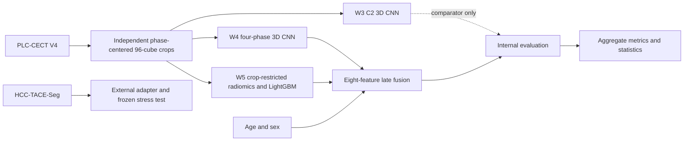

# Multimodal Classification of Primary Liver Tumors on Multiphase CT

Research software and privacy-safe aggregate results for **“Multimodal Classification of
Primary Liver Tumors on Multiphase CT: Internal Fusion Performance and External
Transportability Stress Testing.”**

This repository documents the pipeline that produced the reported results and provides
tested utilities for aggregate reanalysis. It is intended for research and methodological
review only. It is not a medical device and must not be used for clinical diagnosis,
treatment selection, or patient management.

## Research objective

The study compared clinical, deep-learning, radiomics, and late-fusion approaches for
three-class discrimination of hepatocellular carcinoma (HCC), intrahepatic
cholangiocarcinoma (ICC), and combined hepatocellular-cholangiocarcinoma (cHCC-CCA) on
multiphase contrast-enhanced CT. A separate HCC-only cohort was used to stress-test frozen
model transportability under substantial data and adapter shift.

## Cohorts and evaluation design

- Internal PLC-CECT V4 cohort: 278 patients — 94 HCC, 99 ICC, and 85 cHCC-CCA.
- Development cohort: 222 patients with five patient-level stratified folds.
- Independent internal evaluation cohort: 56 patients.
- External HCC-TACE-Seg stress-test cohort: 103 retained known-HCC patients.
- All phases from one internal patient remained in the same partition.
- Patient identifiers, patient-level splits, predictions, images, masks, and clinical rows
  are intentionally not distributed.

The external experiment is not multiclass external validation and does not provide an
external multiclass AUC.

## Pipeline



### Historical internal preprocessing

Each CT phase was independently liver-masked and cropped to a `96 × 96 × 96`-voxel
region centered on the tumor-mask centroid identified in that phase. The four
independently tumor-centered crops were subsequently stacked as input channels for the
multiphase CNN. No explicit interphase registration was performed; therefore, equivalent
voxel locations across channels were not guaranteed to represent identical anatomy.

The implementation is a registration-free, lesion-centered multiphase representation.
It does not use one common set of crop coordinates across P, C1, C2, and C3. The internal
pipeline did not add resampling beyond the source release.

### Model branches

- **W3:** portal-venous C2-only, randomly initialized MONAI 3D ResNet-18 with input shape
  `1 × 96 × 96 × 96`.
- **W4:** four-phase, randomly initialized MONAI 3D ResNet-18 with input shape
  `4 × 96 × 96 × 96`. Training used random in-plane flips applied jointly to the four
  channels and per-channel intensity jitter. No validation or evaluation augmentation was
  used.
- **W5:** PyRadiomics features extracted from the tumor portion retained inside each
  fixed crop, followed by fold-specific feature selection and LightGBM classification.
  The 428 candidate features comprised 107 original-image 3D features per phase.
- **Clinical baseline:** age and sex.
- **Late fusion:** fold-specific multinomial logistic regression.

### Locked full-fusion input

The full-fusion model has exactly eight ordered inputs:

1. W4 HCC probability
2. W4 ICC probability
3. W4 cHCC-CCA probability
4. W5 HCC probability
5. W5 ICC probability
6. W5 cHCC-CCA probability
7. Age
8. Sex

W3 is a comparator and is excluded from full fusion. The order is enforced in
[`fusion.py`](src/liver_tumor_pipeline/fusion.py) and tested with synthetic arrays.

## Verified internal performance

Macro one-versus-rest AUC is the primary metric.

| Model | Five-fold CV AUC, mean ± SD | Held-out AUC |
|---|---:|---:|
| Clinical baseline | 0.650 ± 0.073 | 0.630 |
| W3 single-phase CNN | 0.912 ± 0.048 | 0.860 |
| W4 multiphase CNN | 0.951 ± 0.040 | 0.906 |
| W5 radiomics-LightGBM | 0.922 ± 0.044 | 0.938 |
| CNN + radiomics fusion | 0.955 ± 0.034 | 0.930 |
| Full fusion | 0.955 ± 0.033 | 0.950 |

The held-out full-fusion 95% confidence interval was 0.896–0.988. The tumor-size-only
baseline achieved `0.633 ± 0.080` in cross-validation. Machine-readable values are in
[`internal_performance.csv`](results/aggregate/internal_performance.csv).

### Exploratory DeLong comparisons

Nine per-class comparisons were evaluated. The smallest unadjusted two-sided p-value was
0.0293 for full fusion versus W4 in cHCC-CCA. Full fusion versus W5 radiomics had
`p = 0.3457`. No comparison remained significant after either Bonferroni or
Benjamini-Hochberg adjustment across the nine tests. See
[`delong_summary.csv`](results/aggregate/delong_summary.csv).

## External HCC-only stress test

No retained external patient had all four required phases. The external adapter differed
from the internal workflow in source conversion, resampling, crop construction, available
phases, segmentation inputs, feature availability, and missing-data handling. Degradation
cannot be assigned to any single source of shift.

| Branch or scenario | HCC sensitivity |
|---|---:|
| W3 frozen inference | 5/103 = 0.049 |
| W4 frozen inference | 0/103 = 0.000 |
| Historical external adapter, sex=0 | 2/103 = 0.019 |
| Locked fold-median sex sensitivity analysis, sex=1 | 83/103 = 0.806 |

External sex was unavailable. The historical adapter encoded it as zero. Replacing that
value deterministically with the locked fold-specific median of one required no retraining
or recalibration, but it changed 82 of 103 predicted labels. The value one is a sensitivity
scenario, not a claim about the true sex of external patients. These results demonstrate
instability and do not establish robust external fusion transportability. There is no
verified external CNN-plus-radiomics artifact.

### Radiomics imputation controls

| Condition | HCC sensitivity |
|---|---:|
| Real + imputed | 0.961 |
| Median-only | 1.000 |
| Strict overlap-only | 0.243 |
| Real-only with missing zero | 0.010 |
| Imputed-only with real zero | 0.971 |

The contrast between these controls indicates that apparent external radiomics performance
was strongly influenced by the imputation pathway.

## Fixed-crop retention limitation

The retained artifacts support a C2-only aggregate audit; original geometry and crop
coordinates required for an equivalent four-phase audit were not preserved.

| C2 result | Patients |
|---|---:|
| Exact retention | 124/278 (44.6%) |
| Some tumor loss | 154/278 (55.4%) |
| Below 95% retention | 80/278 (28.8%) |
| Below 90% retention | 67/278 (24.1%) |
| Below 75% retention | 39/278 (14.0%) |
| Below 50% retention | 15/278 (5.4%) |
| Empty crop | 0/278 |

Median C2 retention was 99.89%, the minimum was 15.64%, and volume-weighted retention was
61.46%. The fixed crop retained nearly all voxels for many tumors but meaningfully
truncated a subset. W5 is consequently described as **crop-restricted tumor radiomics**,
not guaranteed complete-lesion radiomics.

## Repository structure

```text
configs/                 Public configuration templates and locked specifications
data/                    Dataset access and non-distribution boundary
docs/                    Scientific methods, provenance, and reproducibility limits
notebooks/               Fourteen curated workflow notebooks
results/aggregate/       Privacy-safe verified aggregate results
results/figures/         Figures generated only from released aggregate tables
scripts/                 Aggregate reanalysis and release-validation commands
src/liver_tumor_pipeline Tested reusable preprocessing, fusion, metric, and audit logic
tests/                   Synthetic-data and release-safety tests
```

## Installation

Python 3.10 or newer is required.

```bash
python -m venv .venv
python -m pip install --upgrade pip
python -m pip install -e .
```

For notebook workflows that require imaging and model libraries:

```bash
python -m pip install -e ".[workflow]"
```

For the test, lint, and public-release validation tools:

```bash
python -m pip install -e ".[test]"
python scripts/smoke_test.py
```

The exact historical software environment was not preserved for every component; the
declared ranges describe compatible public tooling rather than an exact environment
reconstruction.

## Private configuration

Copy `configs/paths.example.yaml` to the ignored file `configs/paths.yaml`, set the
documented environment variables, and keep data and derived patient-level artifacts
outside the repository.

```bash
export PLC_CECT_ROOT=/authorized/location/plc-cect
export HCC_TACE_SEG_ROOT=/authorized/location/hcc-tace-seg
export PRIVATE_ARTIFACT_ROOT=/authorized/location/private-artifacts
export OUTPUT_ROOT=/authorized/location/outputs
```

Windows users can set the same variables through PowerShell or their system environment.
No private location belongs in a committed configuration file.

## Notebooks and reanalysis

The canonical order and each notebook’s runnable status are documented in
[`notebooks/README.md`](notebooks/README.md). Some notebooks require user-obtained datasets
or non-public derived artifacts and fail clearly when those inputs are unavailable. They
do not claim to recreate missing historical checkpoints.

Aggregate checks do not require patient data:

```bash
python scripts/smoke_test.py
python scripts/validate_aggregate_results.py
python scripts/recalculate_delong_summary.py results/aggregate/delong_summary.csv
python scripts/validate_release.py
python -m pytest
```

The smoke test validates the released aggregates and repository safety, then exercises
independent phase-specific preprocessing and the exact eight-feature fusion construction
with synthetic arrays. It neither accesses patient data nor trains a model.

The C2 audit and saved-prediction metric scripts accept authorized local artifacts and emit
aggregate summaries only; their inputs must never be committed.

## Dataset access

- PLC-CECT V4: obtain from the [Science Data Bank record](https://doi.org/10.57760/sciencedb.12207)
  and follow its current terms. The source dataset authors also provide
  [dataset utility code](https://github.com/ljwa2323/PLC_CECT).
- HCC-TACE-Seg: obtain from [The Cancer Imaging Archive](https://www.cancerimagingarchive.net/collection/hcc-tace-seg/)
  and follow the collection’s current data-usage policy.

This repository does not redistribute either dataset.

## Reproducibility and privacy boundaries

The release is a modular, independently auditable analysis framework within the limits of
retained artifacts. It supports saved-prediction metric reanalysis, aggregate statistical
checks, external sensitivity-scenario analysis, C2 retention reporting, and scientific
workflow inspection.

Exact historical inference is limited because W3 fold 1 and W4 fold 0 checkpoints were not
retained. Original internal image geometry and phase-specific crop coordinates were also
not retained. In addition, CNN checkpoints were selected on outer validation folds that
also supplied OOF predictions, and CNN class weights used labels from the complete
222-patient development cohort. These choices can make CV and stacking estimates
optimistic; they were not patient leakage and did not involve the independent 56-patient
evaluation set.

See the [reproducibility statement](docs/reproducibility.md), [artifact contracts](docs/artifact_contracts.md),
and [privacy boundary](docs/privacy_and_data_boundary.md).

## Citation and license status

Citation metadata are provided in [`CITATION.cff`](CITATION.cff). No reuse license has been
granted for the repository contents. In the absence of an explicit license, copyright is
reserved and reuse permission must be obtained from the authors. Dataset licenses and
access terms are governed by their respective providers.
